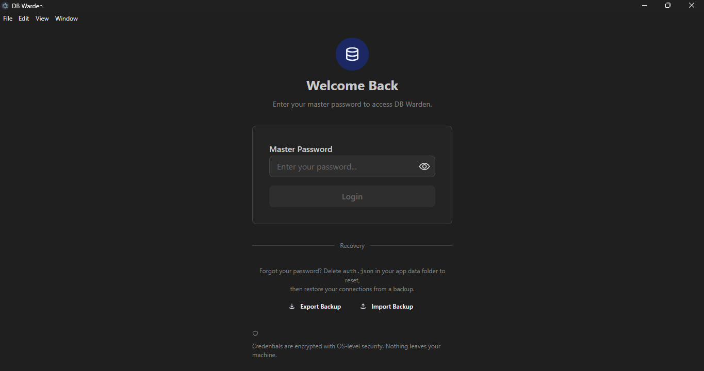
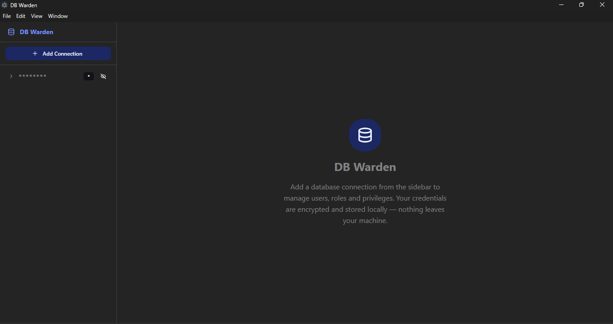

<div align="center">

# 🛡️ DB Warden

**The access-control cockpit for your databases.**

Manage users, roles, and privileges across PostgreSQL, MySQL, MongoDB, Redis, and more — all from one desktop app, with zero SQL writing required.

[](LICENSE)
[](https://github.com/your-username/db-warden/releases)
[](https://electronjs.org)
[](https://react.dev)


</div>

---

## What is DB Warden?

Most database tools let you query data. **DB Warden does one thing differently — it lets you manage *who can touch what*.**

Connect any database and get a visual cockpit to:
- See all users and roles at a glance
- Grant or revoke privileges by clicking a checkbox — no SQL required
- Design role hierarchies with a drag-and-drop graph
- Track every change in a local audit log with one-click revert

Built for developers, DBAs, and teams who manage cloud databases (AWS RDS, Neon, Supabase, MongoDB Atlas, and more) and need a faster, safer way to handle access control.

---

## Features

### 🔐 Secure by design
- **Master password** protects the app on launch (scrypt hashing, OS keychain encryption)
- **Credentials never leave your machine** — all DB connections run in the local Electron main process, never in a browser context
- **Encrypted vault** — all passwords stored with OS-level encryption (`safeStorage`)
- **Session auto-lock** after 30 minutes of inactivity
- **Vault backup & restore** — AES-256-GCM encrypted `.dbwarden` backup files

### 👥 User & Role Management
- List, create, drop, and edit users and roles
- Built-in password generator with strength meter
- Set login/expiry/connection-limit attributes via form — no SQL
- Manage role membership with a multi-select dialog

### 🔒 Permission Matrix
- Visual grid: principals × tables × privileges
- Click a cell to **grant**; click again to **revoke**
- Tri-state cells distinguish *direct grant* vs *inherited via role*
- Bulk grant/revoke per row or column
- **Preview drawer** shows the exact SQL before you apply it

### 🌐 Role Designer
- Create and drop roles via simple forms
- Drag-and-drop role graph (powered by React Flow + Dagre auto-layout)
- Connect nodes to assign membership — the `GRANT role TO user` SQL runs automatically

### 📋 Audit Log
- Every change recorded locally with timestamp, statements, and result
- Filter by date range, action type, status, user, or SQL keyword
- One-click **Revert** for reversible actions (generates inverse SQL)

### 🔌 Multi-Engine Support
| Engine | Users | Roles | Grants | Status |
|---|---|---|---|---|
| PostgreSQL | ✅ | ✅ | ✅ | **Phase 1 — Full support** |
| MySQL / MariaDB | 🔜 | 🔜 | 🔜 | Phase 2 |
| MongoDB | 🔜 | 🔜 | 🔜 | Phase 3 |
| Redis (ACL) | 🔜 | 🔜 | 🔜 | Phase 3 |
| SQLite | ➖ | ➖ | ➖ | Phase 4 (no access layer) |

---

## Screenshots



---

## Getting Started

### Prerequisites
- [Node.js 20+](https://nodejs.org)
- npm 10+

### Run in development

```bash
git clone https://github.com/your-username/db-warden.git
cd db-warden
npm install
npm run dev
```

On first launch you'll be prompted to create a master password. This protects your saved connections.

### Build for production

```bash
npm run build     # compile TypeScript + bundle
npm run package   # create installer (NSIS on Windows, DMG on macOS)
```

Installers are output to `dist-package/`.

---

## Connecting to a Cloud Database

DB Warden works with any reachable PostgreSQL instance. For common cloud providers:

| Provider | Notes |
|---|---|
| **AWS RDS** | Enable SSL, use `require` mode. The app connects as your IAM/master user. |
| **Neon** | Paste the connection string — the form auto-fills. SSL is required. |
| **Supabase** | Use the direct connection string (not pooler) for full role management access. |
| **Azure Database** | SSL required; download the Azure CA cert and paste it in the SSL section. |
| **Cloud SQL (GCP)** | Use a direct IP or Cloud SQL Proxy; SSL `require` mode. |

> **SSH Tunnel support** — need to connect via a bastion host? Enable the SSH Tunnel section in the connection form.

---

## Security Model

```
┌─────────────────────────────────────────┐
│           Renderer (React UI)           │  ← Never sees raw passwords
│                                         │    Never opens DB sockets
└────────────────┬────────────────────────┘
                 │  contextBridge (typed IPC)
                 │  contextIsolation: true
┌────────────────▼────────────────────────┐
│         Main Process (Node.js)          │  ← Owns all DB connections
│                                         │    Owns encrypted vault
│  safeStorage → OS Keychain             │    Auth guard on every handler
│  scrypt (N=16384) → password hash      │
│  AES-256-GCM → vault backup files      │
└─────────────────────────────────────────┘
```

- `contextIsolation: true` + `nodeIntegration: false` — the renderer cannot access Node.js APIs
- All IPC handlers are wrapped in an **auth guard** that rejects calls if the session has expired
- Passwords are never logged, never sent over the network, and never stored in plaintext

---

## Tech Stack

| Layer | Technology |
|---|---|
| Desktop shell | Electron 42, electron-vite |
| UI | React 19, Mantine 9, Tabler Icons |
| State | Zustand, TanStack React Query |
| Permission grid | TanStack Table |
| Role graph | React Flow (@xyflow/react), Dagre |
| DB drivers | `pg`, `mysql2`, `mongodb`, `ioredis` |
| SSH tunneling | `ssh2` |
| Crypto | Node.js built-in `crypto` (scrypt, AES-256-GCM) |
| Schema | Zod |

---

## Contributing

Contributions are welcome! Here's how:

1. Fork the repo
2. Create a feature branch: `git checkout -b feat/mysql-adapter`
3. Commit your changes
4. Open a Pull Request

**Good first contributions:**
- MySQL/MariaDB adapter (`src/main/adapters/mysql.ts`)
- MongoDB adapter
- Redis ACL adapter
- Column-level privilege support in the permission matrix
- Dark/light theme toggle

---

## Roadmap

- [ ] MySQL / MariaDB adapter
- [ ] MongoDB adapter
- [ ] Redis ACL adapter
- [ ] Column-level privilege matrix
- [ ] Connection string auto-paste (parses URL into form fields)
- [ ] Privilege preset templates (e.g. "read-only analyst", "app service account")
- [ ] SQLite graceful no-access panel
- [ ] Settings page with auto-lock timeout configuration

---

## License

[MIT](LICENSE) — free to use, modify, and distribute. Attribution appreciated.

---

<div align="center">
Built with ❤️ · If DB Warden saved you time, consider giving it a ⭐
</div>
